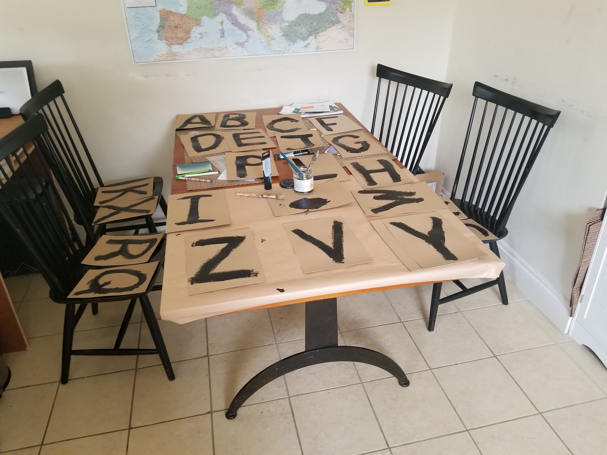
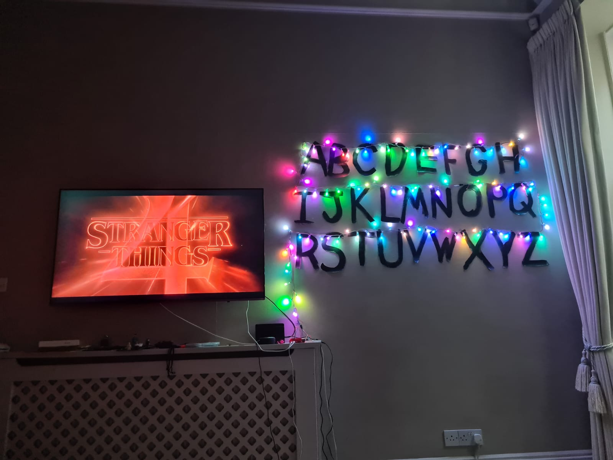

# Will Byers LED Chat


Talk to Will Byers from Stranger Things through LED Christmas lights! This recreates the iconic scene where Will communicates from the Upside Down using individually addressable LEDs.

**Project History:** I originally built this in May 2022 for Stranger Things Season 4, with plans to integrate voice activation using Amazon's Alexa Gadgets API (similar to my [Alexa-enabled Lego Mindstorms maze solver](https://www.hackster.io/kyle22/dwr-an-alexa-voice-enabled-maze-solving-lego-robot-405dbf)). Unfortunately, Amazon discontinued the Alexa Gadgets API before I could complete the integration. With Season 5 on the horizon and the massive improvements in LLMs and speech-to-text technology, I decided to revisit the project—this time with Claude AI bringing Will Byers to life through natural conversation.

## Build Gallery

The complete build process, from planning to final installation:


*Initial planning and LED mapping in the engineering notebook*


*Hand-painting letters on the wall for LED positioning*


*The completed installation with all LEDs positioned and tested*

## Installation

### Using a Virtual Environment (Recommended for Raspberry Pi)

1. Create and activate a virtual environment:
```bash
python3 -m venv venv
source venv/bin/activate
```

2. Install the project and dependencies:
```bash
pip install -e .
```

3. Install system-level GPIO dependencies (if not already installed):
```bash
sudo apt-get update
sudo apt-get install python3-dev
```

4. Install audio dependencies (required for voice chat):
```bash
sudo apt-get install portaudio19-dev
```

### Running with sudo and Virtual Environment

Since GPIO access requires root privileges, you need to use the virtual environment's Python interpreter with sudo:

```bash
# Get the path to your venv Python
which python  # Should show something like /path/to/will_byers/venv/bin/python

# Use that path with sudo
sudo /path/to/will_byers/venv/bin/python -m will_byers.demos.static_messages
```

Or create an alias for convenience:
```bash
alias sudo-venv='sudo $(which python)'
# Then use: sudo-venv -m will_byers.demos.static_messages
```

## Setup

1. Create a `.env` file in your project directory:
```
ANTHROPIC_API_KEY=your-api-key-here
```

2. Wire up your LED strip to GPIO 18 on your Raspberry Pi

3. Create your LED character mapping:
```bash
# Activate your virtual environment first
source venv/bin/activate

# Run the mapping tool with sudo (requires GPIO access)
sudo $(which will-byers-create-mapping)
```

The mapping tool will:
- Light up each LED position (0-149) one at a time
- Prompt you to enter the letter at that position (or press ENTER to skip)
- Save the mapping to `led_mapping.json` in the project root
- Allow you to continue from where you left off if interrupted

**Note:** If you don't create a custom mapping, the system will use the default hardcoded mapping from the original project.

## Creating Your Letter to Light Mapping

The mapping tool helps you create a custom mapping between letters (A-Z) and their corresponding LED positions on your strip. The tool lights up each LED one at a time and prompts you to identify which letter is at that position. The mapping is saved to [`led_mapping.json`](led_mapping.json:1) and can be resumed if interrupted.

Before mapping, make sure you've painted or positioned your letters on the wall and installed your LED strip.

The tool is interactive and self-explanatory - just follow the on-screen prompts to map each letter to its LED position.

## Usage

### Interactive Chat

```bash
# Activate your virtual environment first
source venv/bin/activate

# Run with sudo using the venv Python
sudo $(which python) -m will_byers.chat
# Or if you installed as a script:
sudo $(which will-byers-chat)
```

### Voice Chat

Talk to Will Byers using your voice! The voice chat uses Whisper for speech-to-text transcription.

#### Wake Word Voice Chat (Hands-Free)

The wake word voice chat allows you to activate Will by saying "will" (or a custom wake word). This uses Pocketsphinx for local wake word detection on the Raspberry Pi.

**First, install Pocketsphinx:**
```bash
# Activate your virtual environment first
source venv/bin/activate

# Install pocketsphinx
pip install pocketsphinx
```

**Run the wake word chat:**
```bash
# Run with sudo using the venv Python
sudo $(which python) -m will_byers.wake_word_voice_chat
# Or if you installed as a script:
sudo $(which will-byers-wake-word-chat)
```

**Features:**
- Say "will" to activate (lights will flash to acknowledge)
- Automatically records for 5 seconds after wake word
- Supports both local and remote Whisper transcription
- Customizable wake word and sensitivity

**Advanced options:**
```bash
# Use remote Whisper server for faster transcription
sudo $(which will-byers-wake-word-chat) --remote-whisper http://192.168.1.100:5000

# Custom wake word
sudo $(which will-byers-wake-word-chat) --wake-word "hey will"

# Adjust sensitivity (lower = more sensitive)
sudo $(which will-byers-wake-word-chat) --sensitivity 1e-25

# Change recording duration after wake word
sudo $(which will-byers-wake-word-chat) --record-duration 10
```

#### Manual Voice Chat (Press Enter to Record)

```bash
# Activate your virtual environment first
source venv/bin/activate

# Run with sudo using the venv Python
sudo $(which python) -m will_byers.voice_chat
# Or if you installed as a script:
sudo $(which will-byers-voice-chat)
```

#### Remote Transcription (recommended for better performance)

For better performance, you can run Whisper on a separate machine with a GPU and use it as a remote transcription server:

**On your GPU machine (e.g., desktop with NVIDIA GPU):**

1. Install system dependencies:
```bash
# On Ubuntu/Debian
sudo apt-get update
sudo apt-get install ffmpeg

# On macOS
brew install ffmpeg

# On Windows
# Download from https://ffmpeg.org/download.html
```

2. Install the package:
```bash
pip install -e .
```

3. Start the Whisper server:
```bash
# Use the default base model
will-byers-whisper-server

# Or specify a different model and port
will-byers-whisper-server --model medium --port 5000 --host 0.0.0.0
```

Available models: `tiny`, `base`, `small`, `medium`, `large` (larger = more accurate but slower)

**On your Raspberry Pi:**

```bash
# Run voice chat with remote transcription
sudo $(which will-byers-voice-chat) --remote-whisper http://192.168.1.100:5000

# Replace 192.168.1.100 with your GPU machine's IP address

# Or use with wake word chat
sudo $(which will-byers-wake-word-chat) --remote-whisper http://192.168.1.100:5000
```

The remote server will:
- Use GPU acceleration for faster transcription
- Reduce CPU load on the Raspberry Pi
- Provide better transcription accuracy with larger models

**Note:** The wake word detection always runs locally on the Pi (using Pocketsphinx), only the speech-to-text transcription can be offloaded to the remote server.

### Static Message Demo

```bash
# Activate your virtual environment first
source venv/bin/activate

# Run with sudo using the venv Python
sudo $(which python) -m will_byers.demos.static_messages
```

### Testing Without Hardware

The chat script includes graceful fallback for systems without LED hardware:
```bash
# No sudo needed when running without LEDs
python -m will_byers.chat
```

## Hardware Requirements

- Raspberry Pi (any model with GPIO)
- WS281x LED strip (100 LEDs recommended)
- 5V power supply for LEDs
- Letters A-Z positioned at specific LED indices (see `char_to_pixel_map` in code)

## How It Works

1. Type a message in the terminal
2. It gets sent to Claude AI (playing Will Byers)
3. Will's response appears in the terminal
4. Each letter flashes on its corresponding LED
5. Spaces create dramatic pauses


## Troubleshooting

### Whisper Server Error: "No such file or directory: 'ffmpeg'"

If you encounter this error when running the Whisper server:
```
❌ Error: Server returned error: 500 - {"error":"[Errno 2] No such file or directory: 'ffmpeg'"}
```

**Solution:** Install ffmpeg on your system:

```bash
# On Ubuntu/Debian
sudo apt-get update
sudo apt-get install ffmpeg

# On macOS
brew install ffmpeg

# On Windows
# Download from https://ffmpeg.org/download.html and add to PATH
```

After installing ffmpeg, restart the Whisper server and try again.

### Verifying ffmpeg Installation

To verify ffmpeg is installed correctly:
```bash
ffmpeg -version
```

You should see version information. If you get "command not found", ffmpeg is not installed or not in your PATH.
Just like the show! 🎄
